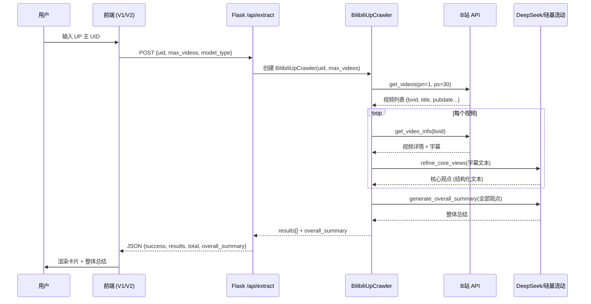
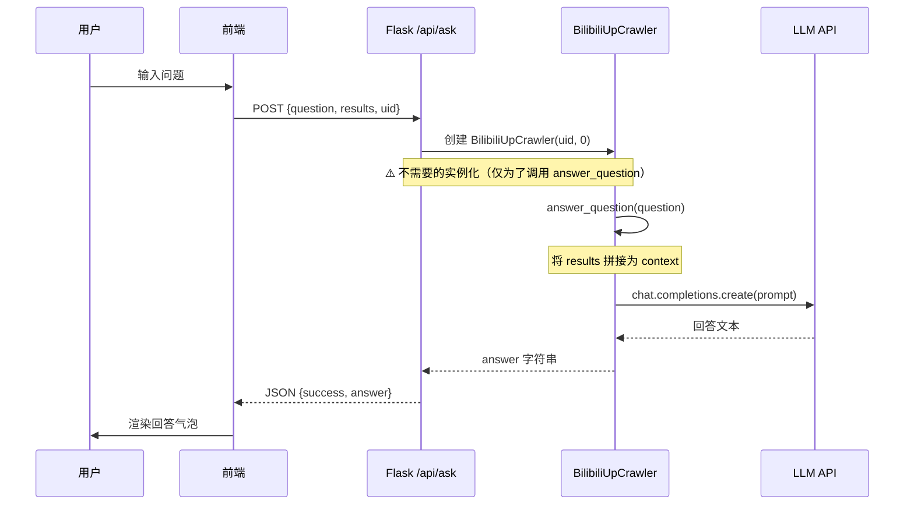

# Bili_summary 架构评审报告

> **评审人**：高见远（Bob），软件架构师  
> **评审日期**：2026-07-15  
> **项目版本**：V1 (Python CLI + Flask + 原生前端) + V2 (React biliinsight-pro)  
> **评审范围**：全栈架构评审，覆盖后端引擎、Flask API、V1/V2 两个前端

---

## 一、系统全景

```
┌─────────────────────────────────────────────────────────┐
│                      用户交互层                          │
│  ┌──────────────────┐    ┌───────────────────────────┐  │
│  │  V1 原生前端       │    │  V2 React (biliinsight-pro) │  │
│  │  HTML+CSS+JS      │    │  React19+Vite+shadcn/ui    │  │
│  │  Port: 5000(静态)  │    │  Port: 3000 (Vite dev)     │  │
│  └────────┬─────────┘    └────────────┬──────────────┘  │
│           │          HTTP/REST         │                 │
│           └──────────┬────────────────┘                 │
├──────────────────────┼──────────────────────────────────┤
│               API 网关层 (Flask)                         │
│  ┌──────────────────┴────────────────────────────────┐  │
│  │  web/app.py                                        │  │
│  │  /api/extract    /api/ask    /api/chat    /api/test│  │
│  │  Port: 5000                                        │  │
│  └──────────────────┬────────────────────────────────┘  │
├──────────────────────┼──────────────────────────────────┤
│               核心引擎层 (Python)                        │
│  ┌──────────────────┴────────────────────────────────┐  │
│  │  main.py → BilibiliUpCrawler                       │  │
│  │  · get_up_videos()   — B站 API 视频列表抓取         │  │
│  │  · process_video()   — 字幕提取 + LLM 观点提炼      │  │
│  │  · generate_overall_summary() — 整体总结            │  │
│  │  · answer_question() — 基于上下文的问答             │  │
│  └──────────────────┬────────────────────────────────┘  │
├──────────────────────┼──────────────────────────────────┤
│               外部服务层                                 │
│  ┌──────────┐  ┌──────────┐  ┌──────────────────────┐  │
│  │ B站 API   │  │ DeepSeek │  │ 硅基流动 (SiliconFlow) │  │
│  │bilibili-  │  │   API    │  │     API               │  │
│  │api-python │  │          │  │                        │  │
│  └──────────┘  └──────────┘  └──────────────────────┘  │
└─────────────────────────────────────────────────────────┘
```

---

## 二、系统分层评审

### 2.1 前后端职责划分

| 层级 | 当前实现 | 评分 | 说明 |
|------|----------|------|------|
| 核心引擎 (main.py) | `BilibiliUpCrawler` 单类承载全部逻辑 | ⭐⭐ | 职责过重，视频抓取、字幕提取、LLM调用、结果保存全部耦合在一个类中 |
| API 层 (web/app.py) | Flask 路由 + 直接导入 main.py | ⭐⭐ | 直接操作全局变量来切换 API Key，线程不安全 |
| V1 前端 (web/) | 原生 HTML/CSS/JS，与 Flask 同进程 | ⭐⭐⭐ | 简单直接，但 500+ 行 script.js 缺乏模块化 |
| V2 前端 (biliinsight-pro/) | React 19 + Vite + shadcn/ui | ⭐⭐⭐ | 技术栈现代，但 App.tsx 650+ 行单体组件 |

**结论**：后端分层基本存在，但每个层内耦合度过高。前后端之间通过 RESTful JSON 通信，边界清晰。

### 2.2 V1 vs V2 的关系

| 维度 | V1 (web/) | V2 (biliinsight-pro) |
|------|-----------|---------------------|
| 定位 | 快速原型 / 功能验证 | 专业化产品 |
| 部署方式 | 与 Flask 同进程，静态文件服务 | 独立 Vite 开发服务器 (port 3000) |
| 依赖 | 零 JS 依赖（仅 CDN Font Awesome） | React 19、shadcn/ui、motion、date-fns 等 |
| 与后端关系 | 同源（无跨域问题） | 跨域（依赖 Flask-CORS） |
| UI 质量 | 基础 CSS，紫色渐变主题 | 专业卡片布局，暗色主题，动画过渡 |
| 功能完整性 | 提取 + 问答 + 历史记录 | 提取 + 问答 + 历史记录 + 整体总结 |

**⚠️ 风险**：V1 和 V2 是两个**完全独立的前端项目**，零代码共享。它们并行存在但功能几乎一致，构成了**维护负担**——任何 API 变更需要同时修改两处。

---

## 三、数据流分析

### 3.1 核心提取流程



### 3.2 问答流程



### 3.3 数据流问题

| 问题 | 严重度 | 说明 |
|------|--------|------|
| `/api/ask` 需要客户端把全部 results 回传 | 🔴 高 | 当 result 数量多时，请求体可能超过合理大小 |
| `/api/chat` 与 `/api/ask` 功能高度重复 | 🟡 中 | 两个端点都做同一件事——把上下文 + 问题发给 LLM |
| results 数据格式不一致 | 🔴 高 | 后端返回的中文字段名（`视频标题`、`核心观点`）在 V2 中需要手动解析、splitting，容易出错 |
| Flask 操作全局变量切换 API Key | 🔴 高 | `web/app.py` 第 55-57 行直接赋值全局变量 `MODEL_TYPE`、`DEEPSEEK_API_KEY`，非线程安全 |

---

## 四、组件复用与模块化解耦

### 4.1 代码重复分析

```
重复类型 A：前端业务逻辑
  web/script.js        ≈ 500 行  ← 提取、显示、保存、历史记录
  biliinsight-pro/App.tsx ≈ 650 行  ← 提取、显示、保存、历史记录 + 动画
  重复率：~70% 业务逻辑相同，0% 代码共享

重复类型 B：LLM 调用
  /api/ask  端点 → answer_question()  → 拼接 prompt → LLM
  /api/chat 端点 → _call_model()     → 拼接 prompt → LLM
  重复率：~80%

重复类型 C：模型初始化
  _init_model_client() 中 openai/deepseek/siliconflow 三个分支
  answer_question() 中再次根据 MODEL_TYPE 选择 model_name
  重复率：部分重复（模型选择逻辑分散在两处）
```

### 4.2 模块化解耦评分

| 模块 | 当前状态 | 评分 | 理想状态 |
|------|----------|------|----------|
| LLM Provider | if-else 分支 + 全局变量 | ⭐ | 策略模式 / Provider 抽象类 |
| B站数据抓取 | 嵌入 BilibiliUpCrawler | ⭐⭐ | 独立 DataFetcher 模块 |
| 提示词工程 | 硬编码在方法内 | ⭐ | 独立的 PromptTemplate 模块 |
| 结果输出 | save_results() 三种格式分支 | ⭐⭐ | Writer 策略模式 |
| 前端 API 层 | fetch 内联写在组件里 | ⭐ | 独立的 api.ts 模块 + React Query |
| 前端状态管理 | useState 分散在 App.tsx | ⭐⭐ | useReducer / Zustand |
| UI 组件库 | shadcn/ui 14 个组件 ✅ | ⭐⭐⭐⭐ | 良好 |

### 4.3 shadcn/ui 组件使用情况

V2 使用了 14 个 shadcn/ui 组件：accordion, badge, button, card, dialog, input, label, scroll-area, select, separator, skeleton, sonner, tabs, textarea。

✅ **亮点**：UI 基础组件层做得很好，通过 shadcn/ui 实现了组件化。  
⚠️ **不足**：这些只是**原子组件**。业务层（提取面板、结果卡片、问答面板、历史列表）仍然是 650 行 App.tsx 的一部分，没有拆分为独立业务组件。

---

## 五、扩展性评估

### 5.1 后端扩展性

| 扩展场景 | 当前实现 | 改动量 | 风险 |
|----------|----------|--------|------|
| 新增 LLM 提供商（如 Claude） | 需修改 3 处：`_init_model_client()` + `answer_question()` + `_call_model()` | 中 | 高——容易遗漏 |
| 支持多 UP 主批量处理 | `BilibiliUpCrawler` 硬编码单 UID | 大 | 低 |
| 新增输出格式（如 PDF） | 在 `save_results()` 加 elif 分支 | 小 | 低 |
| WebSocket 实时进度推送 | Flask 不原生支持 | 大 | 高——需换 FastAPI/SocketIO |
| 用户认证 | 无现有机制 | 大 | 低 |

### 5.2 前端扩展性

| 扩展场景 | V1 | V2 |
|----------|----|----|
| 新增页面（如设置页） | 新 HTML + CSS + JS | 需拆分 App.tsx 或引入路由 |
| 暗色模式切换 | 需大量 CSS 覆盖 | ✅ Tailwind dark: 类即可 |
| 多语言 i18n | 硬编码中文 | 硬编码中文，需引入 i18n 库 |
| 离线 PWA | 需 Service Worker | Vite + PWA 插件即可 |

### 5.3 技术选型评价

| 技术 | 评价 | 建议 |
|------|------|------|
| Flask | 轻量，适合原型，但同步阻塞 | 中期建议迁移 FastAPI |
| bilibili-api-python | 功能完善，多次 fallback 兼容表现好 | 保持 |
| OpenAI SDK (用于 DeepSeek) | 利用兼容 API，巧妙 | 注意模型名称差异 |
| Vite + React 19 | ✅ 现代、快速 | 保持 |
| shadcn/ui | ✅ 组件质量高 | 保持 |
| Tailwind CSS v4 | ✅ 最新版，与 Vite 集成好 | 注意 v4 与 v3 的 API 变化 |
| motion (framer-motion) | ✅ 动画效果好 | 保持 |
| `@google/genai` 依赖 | ⚠️ package.json 中存在但代码中未使用 | 建议移除 |
| `express` 依赖 | ⚠️ package.json 中存在但代码中未使用 | 建议移除 |
| Whisper | ⚠️ `DOWNLOAD_AUDIO = False`，依赖未使用 | 建议从 requirements.txt 移除 |

---

## 六、潜在问题（风险清单）

### 🔴 严重 (Blocking)

| # | 问题 | 影响 | 证据 |
|---|------|------|------|
| 1 | **API Key 泄露** | `biliinsight-pro/.env.local` 包含明文 `GEMINI_API_KEY=AIzaSyBz...`，如果该文件已提交 Git，密钥已泄露。目录下有 `.git` 文件夹，存在风险。 | `.env.local` 文件内容 |
| 2 | **BilibiliUpCrawler 职责过重** | 单一类承担数据抓取、字幕提取、LLM 调用、结果保存、问答等所有职责，违反单一职责原则，导致修改一处可能影响所有功能。 | `main.py` 中 500+ 行的单类 |
| 3 | **Flask 全局变量突变** | `web/app.py` 第 55-57 行直接修改 `MODEL_TYPE`、`DEEPSEEK_API_KEY`、`SILICONFLOW_API_KEY` 全局变量。在多用户并发时，不同请求会互相覆盖彼此的配置。 | `web/app.py` L55-57, L103-106 |

### 🟠 高危 (High)

| # | 问题 | 影响 | 证据 |
|---|------|------|------|
| 4 | **V1/V2 双前端维护** | API 任何变更需同时修改 `web/script.js` 和 `biliinsight-pro/App.tsx`，极易出现不一致。 | 两个独立前端目录 |
| 5 | **App.tsx 单体组件** | 650+ 行单文件，包含提取、结果、问答、历史四大功能，难以测试和复用。 | `App.tsx` 文件 |
| 6 | **无 API 请求校验** | Flask 端点直接使用 `request.json.get()`，不做 schema 校验。无效输入会导致难以追踪的错误。 | 无 pydantic/marshmallow |
| 7 | **`sync()` 滥用** | `main.py` 中大量使用 `sync()` 包装异步 API，每次调用都创建新的事件循环，性能低下。 | `main.py` 中多处`sync(u.get_videos(...))` |
| 8 | **中文键名作为数据契约** | 后端返回 `{'视频标题': ..., '核心观点': ...}`，V2 用 `r['视频标题']` 解析。键名变更即破坏前端。 | `main.py` save_results() / `App.tsx` L128-139 |
| 9 | **硬编码 API 地址** | `http://localhost:5000` 硬编码在 `web/script.js` 和 `App.tsx` 中，部署到生产环境需改代码。 | `script.js` / `App.tsx` 顶部常量 |

### 🟡 中等 (Medium)

| # | 问题 | 影响 | 证据 |
|---|------|------|------|
| 10 | **无持久化存储** | 所有数据仅存于浏览器 localStorage，刷新即丢失。无服务端数据库。 | 无数据库文件 |
| 11 | **日志缺失** | 全项目使用 `print()` 而非 Python logging 模块，无法控制日志级别和输出目标。 | `main.py` / `web/app.py` |
| 12 | **无测试覆盖** | 项目零测试文件，无法保证回归安全。 | 无 test_*.py |
| 13 | **死依赖** | `whisper`（已禁用下载）、`@google/genai`、`express` 在依赖列表中但未使用。 | `requirements.txt` / `package.json` |
| 14 | **Footer 误导** | V2 footer 显示 "Powered by Google Gemini AI"，但实际调用的是 DeepSeek。 | `App.tsx` 底部 footer |
| 15 | **无速率限制** | API 不限制调用频率，容易被滥用或触发 B站/LLM API 的限流。 | 无中间件 |
| 16 | **`/api/ask` 需要客户端回传全部 results** | 大量视频时请求体过大，且服务端每次重新实例化 `BilibiliUpCrawler(uid, 0)` 仅为了调用 `answer_question()`。 | `web/app.py` L83-84 |

### 🔵 低 (Low)

| # | 问题 |
|---|------|
| 17 | `page_size` 参数兼容性尝试了 4 种 fallback 方式，说明 bilibili-api 版本迭代快、API 不稳定 |
| 18 | V2 `index.html` 标题为 "My Google AI Studio App"，与产品名不符 |
| 19 | `启动工具.bat` 使用 `cmd /k` 启动后端，用户体验粗糙 |

---

## 七、改进建议（按优先级排序）

### P0 🔴 立即修复

| # | 建议 | 预期效果 |
|---|------|----------|
| 1 | **轮换泄露的 API Key**：立即到 Google Cloud Console 吊销 `.env.local` 中的 Gemini Key，生成新 Key | 消除安全隐患 |
| 2 | **确认 `.env.local` 未提交 Git**：检查 `biliinsight-pro/.git` 历史，如果已提交则清理 | 防止密钥持续泄露 |
| 3 | **修复 Flask 全局变量竞态**：将 API Key 作为实例属性传入 `BilibiliUpCrawler`，而非修改全局变量 | 消除并发 Bug |

### P1 🟠 架构重构（建议 1-2 周）

| # | 建议 | 涉及文件 | 预期效果 |
|---|------|----------|----------|
| 4 | **LLM Provider 策略模式**：```python\nclass BaseLLMProvider(ABC):\n    @abstractmethod\n    def chat(self, prompt: str) -> str: ...\n\nclass DeepSeekProvider(BaseLLMProvider): ...\nclass SiliconFlowProvider(BaseLLMProvider): ...\n``` | `main.py` 新增 `providers/` | 新增提供商仅需添加一个类 |
| 5 | **Pydantic 请求校验**：```python\nfrom pydantic import BaseModel\nclass ExtractRequest(BaseModel):\n    uid: str\n    max_videos: int = 10\n    model_type: Literal["deepseek", "siliconflow"] = "deepseek"\n``` | `web/app.py` | 输入校验 + 自动生成文档 |
| 6 | **拆分 App.tsx**：```\nsrc/\n├── components/\n│   ├── ExtractionPanel.tsx\n│   ├── ResultsView.tsx\n│   ├── ChatPanel.tsx\n│   ├── HistoryPanel.tsx\n│   └── Layout/\n├── hooks/\n│   ├── useExtraction.ts\n│   ├── useChat.ts\n│   └── useHistory.ts\n├── api/\n│   └── client.ts\n└── types/\n    └── index.ts\n``` | `biliinsight-pro/src/` | 每个文件 < 200 行，可独立测试 |
| 7 | **前端 API 层**：抽取 `api/client.ts` 统一管理端点、base URL、错误处理 | `biliinsight-pro/src/` + `web/script.js` | API 变更只需改一处 |
| 8 | **统一数据契约**：使用英文键名 + TypeScript 类型定义，后端也使用一致结构 | 前后端 | 消除中文键名耦合 |

### P2 🟡 质量提升（建议 2-4 周）

| # | 建议 | 预期效果 |
|---|------|----------|
| 9 | **合并 `/api/ask` 和 `/api/chat`**：统一为一个 `/api/chat` 端点，接收 `{session_id, question}` | 消除重复，支持多轮对话 |
| 10 | **引入 Python logging**：替换所有 `print()` 为 `logging.getLogger(__name__)` | 可分级、可重定向的日志 |
| 11 | **添加服务端会话管理**：用简单的 JSON 文件或 SQLite 存储 session → results 映射，避免客户端回传大量数据 | 减少请求体积 |
| 12 | **清理死依赖**：移除 `whisper`（Python）、`@google/genai`、`express`（Node） | 减小依赖树，加快安装 |
| 13 | **修复 V2 标题和 Footer**：`index.html` → "BiliInsight Pro"，footer → "Powered by DeepSeek" | 消除用户困惑 |

### P3 🔵 长期演进

| # | 建议 | 预期效果 |
|---|------|----------|
| 14 | **迁移到 FastAPI**：利用 async/await 并发处理多个 LLM 请求 + 自动 OpenAPI 文档 | 性能提升 + 开发体验 |
| 15 | **引入 React Router**：支持 `/extract`、`/history`、`/settings` 多页面 | 可扩展性 |
| 16 | **添加状态管理**：Zustand 或 Jotai 替代分散的 useState | 跨组件状态共享 |
| 17 | **建立 CI/CD**：GitHub Actions 运行 lint + type check + test | 质量保障 |
| 18 | **E2E 测试**：Playwright 覆盖核心提取流程 | 回归保护 |
| 19 | **决定 V1 去留**：如果 V2 是未来方向，建议标记 V1 为 deprecated，文档中引导用户使用 V2 | 减少维护负担 |

---

## 八、总结

### 一句话评价

> **核心引擎可用、功能完整，但架构耦合度高、存在安全隐患，处于"原型向产品过渡"的拐点。**

### 雷达图（定性评分）

| 维度 | 评分 (1-5) | 说明 |
|------|:--------:|------|
| 功能完整性 | ⭐⭐⭐⭐ | 核心功能齐全，提取 + 问答 + 历史记录 |
| 代码质量 | ⭐⭐ | 单体类/组件，硬编码多 |
| 安全性 | ⭐ | API Key 泄露风险，无认证机制 |
| 可扩展性 | ⭐⭐ | 新增提供商/功能需大量改动 |
| 可维护性 | ⭐⭐ | 双前端维护负担，无测试 |
| 性能 | ⭐⭐ | 同步阻塞，sync() 滥用 |
| 用户体验 | ⭐⭐⭐ | V2 UI 专业，有动画和良好视觉设计 |

### 最关键的三个行动

1. 🔴 **立即轮换泄露的 API Key**
2. 🟠 **重构 BilibiliUpCrawler + LLM Provider 抽象**
3. 🟠 **拆分 V2 App.tsx + 建立前端 API 层**

---

*报告完毕。如需对任何建议进行深入设计，或需要我输出详细的重构方案，请随时召唤。*

— 高见远 (Bob)
